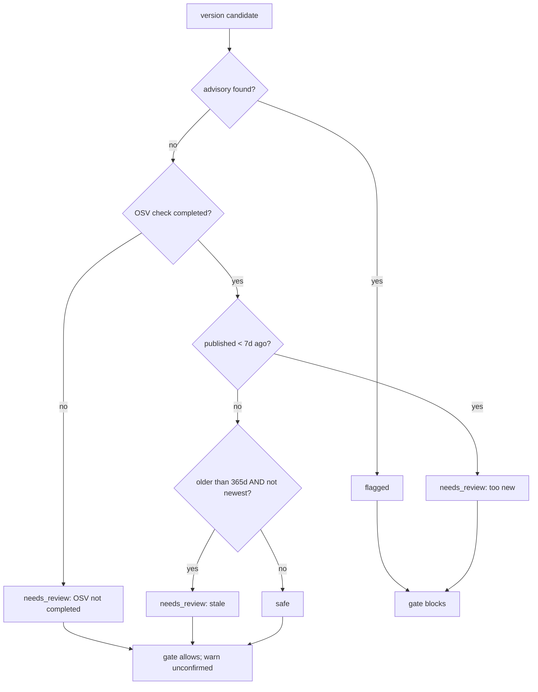

# AGENTS.md - package-sentinel-core

Engineering reference for the Package Sentinel vetting core. The end-user story (install via an adapter, verdicts, policies) lives in README.md - keep the two consistent when you edit either. This file documents the internals: the module tour, configuration source locations, tests, and invariants.

**The design why:** a blocking gate alone can be bypassed - an agent can edit a manifest file directly or call an unvetted tool. So the verdict model is strict on evidence: a version whose OSV check did not complete is _never_ reported `safe`. Flagged and too-new versions always block; an OSV-unconfirmed install passes with a loud "not vetted" warning; `PACKAGE_SENTINEL_FAIL_CLOSED=1` restores deny-on-unconfirmed. Everything below follows from that.

## How it works

All public symbols are re-exported from `src/index.ts`. The npm package is planned but not yet published, so programmatic use today means importing from a checkout of this repo:

```ts
import { createVetter, findManifest, isBlocked, isUnconfirmedPass } from 'package-sentinel-core';

const manifest = findManifest(process.cwd());
if (!manifest) throw new Error('no supported manifest at cwd');
const vetter = createVetter(process.cwd());
const verdict = await vetter.vet('lodash', '4.17.19');
if (!verdict || isBlocked(verdict)) throw new Error(`refuse lodash@4.17.19: ${verdict?.reason}`);
if (isUnconfirmedPass(verdict)) console.warn(`not vetted: ${verdict.reason}`);
```

### `src/contracts.ts` - shared types

```ts
type Ecosystem = "npm" | "pypi" | "rust";
type VerdictLabel = "safe" | "flagged" | "needs_review";
type Severity = "unknown" | "low" | "moderate" | "high" | "critical";

interface PackageRef        { name: string; ecosystem: Ecosystem }
interface RegistryVersion   { version: string; publishedAt: string } // ISO-8601
interface Advisory          { id: string; summary: string; severity: Severity; affectedVersions: string[] }
interface PerVersionVerdict { version: string; verdict: VerdictLabel; reason: string; advisories: Advisory[]; isOsvChecked: boolean; tooNew?: boolean }
type    ManifestKind        = { file: "package.json"|"pyproject.toml"|"requirements.txt"|"Pipfile"|"Cargo.toml"; ecosystem: Ecosystem }
interface ManifestDetection { ecosystem: Ecosystem; kind: ManifestKind; path: string }
interface ManifestSnapshot  { path: string; content: string }
interface FlaggedLeak       { manifestPath: string; pkg: PackageRef; version: string; reason: string }

interface RegistryAdapter   { listVersions(pkg: PackageRef): Promise<RegistryVersion[]> }
interface OsvClient         { queryAdvisories(pkg: PackageRef, version: string): Promise<Advisory[]> }
type    DecideVersion      = (ref, versions, advisoriesFor, osvCheckedFor) => PerVersionVerdict[]
type    DetectManifest     = (path: string) => ManifestDetection | null
type    ToolCallHook       = (params: { tool; args }) => BlockDecision | { block: false }
type    AssertInstallable  = (ref, verdict) => void
type    ValidatePostWrite  = (before, after, verdictOf) => FlaggedLeak[]
class   FlaggedVersionError extends Error { constructor(readonly ref: PackageRef) }
```

The invariant everything relies on: a `safe` verdict is emitted only when `isOsvChecked === true`.

### `src/detect.ts` - manifest detection

```ts
detectKindFromName(name: string): ManifestKind | null
detectManifest(path: string): ManifestDetection | null
```

`detectKindFromName` maps `package.json`→npm; `pyproject.toml`/`requirements.txt`/`Pipfile`→pypi; `Cargo.toml`→rust. Anything else returns `null`.

### `src/registry.ts` - version resolution

```ts
createAdapter(ecosystem: Ecosystem): RegistryAdapter
class NpmAdapter    // npm: `versions` object + `time` map
class PypiAdapter   // pypi: `releases` object with `upload_time`
class CratesAdapter // crates.io: `versions` array of `{ num, created_at }`
```

Endpoints (`REGISTRY_URL`): npm `https://registry.npmjs.org/<name>`; PyPI `https://pypi.org/pypi/<name>/json`; crates.io `https://crates.io/api/v1/crates/<name>`. `parseResponse` is dependency-free and testable. `listVersions` throws `Error("registry http <status>")` on non-2xx.

### `src/osv.ts` - advisory lookup

```ts
class OsvTransportError extends Error
parseOsvResponse(body: unknown): Advisory[]
createOsvClient(fetchImpl?): OsvClient
```

Posts `{ package: { name, ecosystem }, version }` to `https://api.osv.dev/v1/query` (version-level). Ecosystem names sent to OSV: npm→`npm`, pypi→`PyPI`, rust→`crates.io`. Any transport failure or non-2xx becomes `OsvTransportError`, so callers can never mistake "unable to check" for "no advisories". Unknown severities normalize to `"unknown"`.

### `src/decide.ts` - verdict engine

```ts
decideVersion(ref, versions, advisoriesFor, osvCheckedFor, now = new Date()): PerVersionVerdict[]
```

Priority per version:

1. any advisory → `flagged` (reason lists advisory ids)
2. OSV check not completed → `needs_review` (`osvChecked:false`) - _never_ `safe`
3. published < **7 days** ago → `needs_review` ("too new") - **blocks by default** (`tooNew: true`); supply-chain cooldown
4. published > **365 days** ago **and** not the newest → `needs_review` ("stale; newer version exists")
5. otherwise → `safe`

Thresholds are module constants `TOO_NEW_DAYS = 7` and `STALE_DAYS = 365`.

### `src/enforce.ts` - Firing Point 1 (the gate)

```ts
isBlocked(verdict): boolean                    // flagged or tooNew ✓ always; OSV-unconfirmed only under fail-closed
isUnconfirmedPass(verdict): boolean            // OSV-unconfirmed ✓ && !isBlocked (fail-open pass)
assertInstallable(ref, verdict): void          // throws FlaggedVersionError when isBlocked
guardToolCall({ tool, args }, verdictOf): { block: true, reason } | { block: false }
makeAssertTool(verdictOf): (args) => { blocked: boolean; reason?: string }
extractTargets(args): Array<{ name, version }>
osvFailClosed(env?): boolean                   // reads PACKAGE_SENTINEL_FAIL_CLOSED
```

The gate predicate `isBlocked` **blocks by default** on `flagged` (known-vulnerable) and `tooNew` (published within the 7-day supply-chain cooldown) versions; an OSV-unconfirmed version (not listed / check did not complete) passes unless `PACKAGE_SENTINEL_FAIL_CLOSED=1` restores deny-on-unconfirmed. A stale checked `needs_review` (superseded but OSV-clean) still passes. `isUnconfirmedPass` lets adapters surface a loud "not vetted" warning when fail-open lets an unconfirmed version through (rather than a silent pass). `extractTargets` reads `name@version` specs from keys `packages`/`dependencies`/`deps`/`targets`/`add`, or `package`+`version`.

### `src/postwrite.ts` - Firing Point 2 (validation)

```ts
extractDeps(content, kind): Record<string, string>
diffManifests(beforeContent, afterContent, kind): { added, removed }
validatePostWrite(before, after, verdictOf): FlaggedLeak[]
```

`package.json` merges `dependencies` + `devDependencies`; `requirements.txt` uses `name<op>version` lines; TOML-ish kinds use `name = "version"` / `name = { version = "..." }`. A version **change** is reported under `added`. `validatePostWrite` surfaces a `FlaggedLeak` for any added dep whose verdict is `flagged`.

### `src/pin.ts` - safe-version pinning

```ts
isRangeSpec(spec: string): boolean
pickExactPin(declaredSpec, versions, isBlocked): Promise<string | null>  // newest matching non-blocked exact
applyPins(content, kind, pins): string
pinManifestChanges(before, after, versionsFor, vet): Promise<ManifestSnapshot[]>
```

Uses transitive `semver` (`satisfies`/`rcompare`) to resolve a range like `^1.9.0` to the newest exact version inside it whose verdict is not blocked (`flagged` always skipped; OSV-unchecked candidates also skipped under the fail-closed toggle). `pinManifestChanges` diffs newly-added range deps and rewrites them to exact pins across formats - `package.json`, `requirements.txt` (`name==<pin>`), and TOML (`pyproject.toml`/`Cargo.toml`/`Pipfile`).

### `src/orchestrate.ts` - wiring the parts

```ts
findManifest(cwd: string): ManifestDetection | null              // first supported manifest at cwd (cwd itself only)
findManifests(cwd, excludes?, maxDepth?): ManifestDetection[]    // every supported manifest under cwd + subfolders
createVetter(cwd, deps?): Vetter
snapshotManifests(cwd: string): ManifestSnapshot[]
detectLeaks(before, after, vet): Promise<FlaggedLeak[]>
auditManifest(vetter): Promise<AuditEntry[]>                     // every dep in ONE manifest
auditAllManifests(cwd, { excludes?, deps? }): Promise<AuditResult[]> // every manifest in the tree (--exclude)
```

`Vetter = { manifest, vet(name, version), versions(name), recommendSafeVersion(name) }`.

- `vet(name, version)` runs `listVersions` → `queryAdvisories` → `decideVersion`, memoized per `ecosystem::name@version`. **Any lookup failure returns `needs_review` with `isOsvChecked:false` (never `safe`)**; a version absent from the registry's list yields a `needs_review`/`isOsvChecked:false` verdict "version not found in registry".
- `recommendSafeVersion(name)` returns the newest OSV-confirmed, non-blocked version (skips `flagged`, `tooNew`, and unchecked), newest-first, capped at `RECOMMEND_SCAN_LIMIT` (10) to bound OSV cost - or `null` when none is safe.
- `detectLeaks` surfaces `flagged` leaks always, plus unvalidated (`isOsvChecked:false`) leaks under the fail-closed toggle.
- `auditManifest` vets **every** dependency currently in the manifest (not just additions): an exact spec is vetted directly, a range resolves to the newest satisfying version first. Returns `AuditEntry[]` - each entry's `blocked` respects the fail-open/fail-closed toggle, so `audit` doubles as a CI gate. Closes the gap the additive gate leaves open (pre-existing vulnerabilities, range→range bumps).
- `deps.adapter` / `deps.osv` are optional injection seams so tests exercise the network path without a network.

## Verdict decision flow



## Consumers

| Consumer                           | Uses                                                                                                                       | Verified against                                       |
| ---------------------------------- | -------------------------------------------------------------------------------------------------------------------------- | ------------------------------------------------------ |
| `@gizmos/pi-package-sentinel`     | `createVetter`, `detectLeaks`, `extractTargets`, `isBlocked`, `pinManifestChanges`, `snapshotManifests`, types             | `packages/pi-package-sentinel/src/index.ts`            |
| `@gizmos/claude-package-sentinel` | `createVetter`, `detectLeaks`, `extractTargets`, `isBlocked`, `pinManifestChanges`, `snapshotManifests` + the CLI contract | `packages/claude-package-sentinel/shared.ts`, `cli.ts` |

Adapters own the runtime wiring; see their AGENTS.md files (the pi↔Claude firing-point parity table lives there).

## Configuration (source locations)

| Knob                    | Value                                                                                                              | Location             |
| ----------------------- | ------------------------------------------------------------------------------------------------------------------ | -------------------- |
| "too new" threshold     | `TOO_NEW_DAYS = 7` - **block by default** (supply-chain cooldown)                                                  | `src/decide.ts`      |
| "stale" threshold       | `STALE_DAYS = 365`                                                                                                 | `src/decide.ts`      |
| recommendation scan cap | `RECOMMEND_SCAN_LIMIT = 10`                                                                                        | `src/orchestrate.ts` |
| gate mode               | `PACKAGE_SENTINEL_FAIL_CLOSED` - unset/`0`/`false`/`no`/`off` = fail-open (default); any other value = fail-closed | `src/enforce.ts`     |

Endpoints and OSV ecosystem names are constants in `src/registry.ts` (`REGISTRY_URL`) and `src/osv.ts` (`OSV_ECOSYSTEM`). The core is **stateless** - registries and OSV are queried on demand per vet, with per-`createVetter` instance verdict caches. It never calls an LLM, so it has no model config.

## Testing & validation

```bash
npm test           # unit suite - 76 tests (node --test, test/*.test.ts) - verified green this session
npx tsc --noEmit   # strict typecheck (package script "check")
```

| Area                                                   | What it proves                                                                                                                | File                       |
| ------------------------------------------------------ | ----------------------------------------------------------------------------------------------------------------------------- | -------------------------- |
| Manifest detection                                     | supported-name → ecosystem map; unsupported → null                                                                            | `test/detect.test.ts`      |
| Registry adapters                                      | npm/PyPI/crates `.parseResponse`; http error                                                                                  | `test/registry.test.ts`    |
| OSV client                                             | advisory parse; transport failure → `OsvTransportError`; version-level query                                                  | `test/osv.test.ts`         |
| Verdict engine                                         | advisory→flagged; unchecked→needs_review; too-new (blocks)/stale; safe only when checked                                      | `test/decide.test.ts`      |
| Gate (`isBlocked`/`guardToolCall`/`assertInstallable`) | flagged and too-new always block; osv-unchecked blocks only under `PACKAGE_SENTINEL_FAIL_CLOSED`; checked needs_review passes | `test/enforce.test.ts`     |
| Vetter fail-closed                                     | OSV failure → unchecked; not-in-registry → unchecked; recommendSafeVersion skips blocked                                      | `test/orchestrate.test.ts` |
| Post-write                                             | flagged leaks surfaced; safe no-op; deps per format                                                                           | `test/postwrite.test.ts`   |
| Pin                                                    | range→newest non-blocked exact; ignores already-exact; skips blocked                                                          | `test/pin.test.ts`         |

## Invariants

- `safe` requires `isOsvChecked === true` - a version OSV could not confirm is never `safe` (design invariant NFR-1 / AC-5, `src/index.ts` doc comment).
- Registry/OSV failures degrade to needs_review, never to `safe` - "unable to check" is never confused with "no advisories" (`OsvTransportError`).
- The core never writes to the filesystem; write-back (pin) is the adapter's choice (pi writes in `pinAndClose`; Claude pins in `PostToolUse`).
- No LLM calls, no runtime imports - adapters must stay the only runtime-coupled layer, or the "fix once, both adapters inherit" property breaks.
- Direct dependencies of supported manifests only - no transitive/lockfile graphs, no SBOM, exactly the three ecosystems NPM/PyPI/crates.io, and no CI/CD supply-chain suite beyond `auditAllManifests`.
