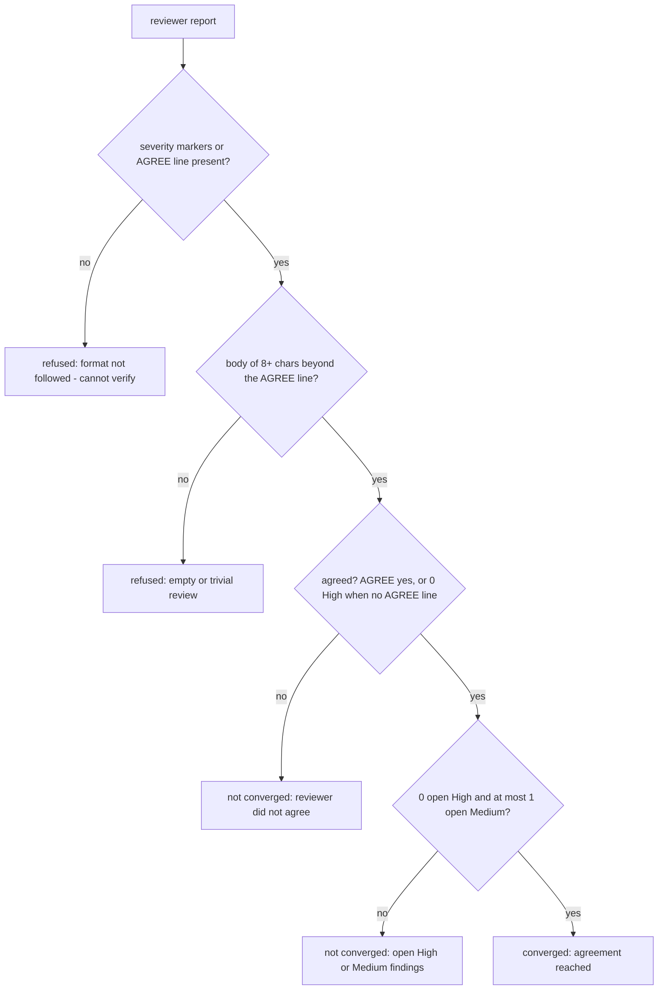

# AGENTS.md - sanity-check-core

Engineering reference for the Sanity Check verdict core (the shared brain of the cross-model agree/disagree loop). The end-user story (what the tool is, the loop, the convergence rules) lives in README.md - keep the two consistent when you edit either. The two adapter surfaces document their own wiring in `../pi-sanity-check/AGENTS.md` and `../claude-sanity-check/AGENTS.md` (the pi↔Claude parity table lives there, mirrored in both directions). The sibling core with the same shape: `../package-sentinel-core/AGENTS.md`.

**The design why:** the whole point of this core is that a verdict fix lands in every surface at once (pi, Claude Code, and any future adapter), so everything here is pure string/decision logic over structural types: no runtime imports, no env reads, no I/O, no loop - the loop lives in the adapters. Two defenses are baked in because model reviewers are format-unreliable in the wild: the classifier reads severity markers _generously_ (emoji, textual labels, heading containers, and bold-item formats all occurred in real reviews - the self-check carries regressions for the false `0 High / 0 Medium` B's bold/heading format once caused), while the convergence rubric is deliberately strict: unverifiable means not converged.

## How it works

All public symbols are re-exported from `src/index.ts`. The npm package is planned but not yet published, so programmatic use today means importing from a checkout of this repo:

```ts
import { classifyReport, convergenceFor } from '@gizmos/sanity-check-core';

const v = classifyReport(reviewText);
const { isConverged, reason } = convergenceFor(v);
```

### `src/core.ts` - verdict logic

```ts
MAX_ROUNDS = 3                                        // round cap; both adapters import it (src/core.ts:15)
REVIEWER_SYSTEM: string                               // B's system prompt: independent CTO skeptic; report must end "AGREE: yes|no" (src/core.ts:17)
PRODUCER_SYSTEM: string                               // A's system prompt: revise High/Medium, return deliverable + [resolved]/[disputed] changelog (src/core.ts:33)
type Nullable<T> = T | null | undefined               // always-present field that may hold null (src/core.ts:13)
interface Verdict {                                   // (src/core.ts:89)
  isAgreed: Nullable<boolean>                         // explicit AGREE parse; undefined when no line
  high: number; medium: number                        // finding counts
  isFormatFollowed: boolean                           // severity markers or an AGREE line present
  hasBody: boolean                                    // substantive content beyond the AGREE line
}
parseAgree(text): boolean | undefined                 // /AGREE:\s*(yes|no)\b/i (src/core.ts:98)
blocksToText(content): string                         // block array → text; falls back to `thinking` blocks (src/core.ts:45)
extractLastAssistantText(entries): string             // newest assistant text; {role,content} and {message:{...}} shapes (src/core.ts:73)
class ModelNotFoundError extends Error                // "Model not found in registry: <provider>/<id>" (src/core.ts:105)
resolveFullModel(registry, {provider,id}): M          // full registered model; throws on miss (src/core.ts:125)
resolveModel(models, query): {provider,id} | undefined  // provider/id or bare id; cloud-suffix preference (src/core.ts:153)
classifyReport(text): Verdict                         // (src/core.ts:226)
convergenceFor(v): { isConverged: boolean; reason: string }  // (src/core.ts:275)
```

The prompts fix the cross-model contract: B ends with `AGREE: yes|no` and severity-tags findings (🔴 High / 🟡 Medium / 🟢 Low); A returns the REVISED deliverable first, then a short changelog with `[resolved]`/`[disputed]` lines - an unfixed concern must carry reasoning, not dismissal. A prompt fix lands in both surfaces at once.

`classifyReport` counts findings from lines, not prose. Finding-line candidates: bullets (`-`/`*`), numbered or `•` markers, bold emoji lines (`**🔴 High - ...**`), and emoji headings (`#### 🔴 High - one`); bold numbered items (`**H1. ...**`) count under a bare section container (`### 🔴 High`). The container-vs-finding split: a heading with a title after the severity (`#### 🔴 High - one`) is one self-contained finding; a bare `### 🔴 High` opens a section whose untagged findings inherit its severity. Severity words outside finding lines never count, and High is negation-guarded (`no high` / `not.*high`). `isFormatFollowed` is true when recognizable severity markers or an explicit AGREE line exist; `hasBody` needs ≥ 8 chars of report with the AGREE line removed.

`convergenceFor` decides in order: format followed? body real? agreed? then the rubric. `agrees` is the explicit parse, or - when B emitted no AGREE line - implied by 0 High. `isConverged` requires agreed AND 0 High AND ≤1 Medium; open Low findings never block. Refusal reasons name the gap (`reviewer did not follow the output format - cannot verify agreement`, `reviewer returned an empty or trivial review - not a real approval`, or joined parts).

`resolveFullModel` returns the FULL registered model (baseUrl/api/config), because passing a stripped `{provider,id}` historically produced an empty assistant reply; on a miss it throws `ModelNotFoundError` rather than silently passing the stripped object back.

`resolveModel` accepts `provider/id` or a bare id and falls back through stripped cloud-suffix variants (`:cloud`, `-cloud`, `_cloud`, and `:cloud` with anything after). When several providers serve the same id (e.g. `opencode-go/glm-5.1` and `ollama-cloud/glm-5.1`): a cloud hint - in the query suffix or the provider name - prefers cloud-named providers before falling back; a bare id takes the first listed provider. Returns `undefined` when nothing matches.

`blocksToText`/`extractLastAssistantText` shape the model IO: block arrays join their text blocks; a reasoning-only reply (exhausted output budget left only a `thinking` block) falls back to that thinking instead of `""` - so an empty revision can never be fed to B as a deliverable. Entry lists may be `{role, content}` or wrapped as `{message: {role, content}}`; the newest assistant entry wins and later non-assistant entries are skipped.

Deliberately NOT here: the loop itself, deliverable sourcing, cancellation handling, any I/O or persistence - all of that is adapter wiring.

### `src/chat.ts` - OpenAI-compatible transport

```ts
chatComplete({ baseURL, model, system, user, maxTokens? }): Promise<string>  // (src/chat.ts:10)
```

The one transport helper, for adapters that run outside a host LLM session (the Claude Code plugin calls the endpoint directly; the pi adapter uses the host's model registry and does not import this). POSTs to `<baseURL with trailing slashes stripped>/chat/completions` - system + user messages, `max_tokens ?? 800`, `temperature: 0` - and returns the trimmed `choices[0].message.content` string (or `""`). Non-2xx throws `HTTP <status>: <first 300 chars of the body>`, so an endpoint failure surfaces loudly instead of becoming a false success. No streaming, no retries, no auth headers.

### `src/index.ts` - the public surface

Pure re-exports of everything above, with a module doc comment carrying the design invariants (hollow-approval refusal, never-silently-empty replies). No logic of its own.

## Convergence decision flow



## Consumers

| Consumer                       | Uses                                                                                                                                                                               | Verified against                      |
| ------------------------------ | ---------------------------------------------------------------------------------------------------------------------------------------------------------------------------------- | ------------------------------------- |
| `@gizmos/pi-sanity-check`     | `classifyReport`, `convergenceFor`, `parseAgree`, `MAX_ROUNDS`, `REVIEWER_SYSTEM`/`PRODUCER_SYSTEM`, `resolveModel`/`resolveFullModel`, `blocksToText`, `extractLastAssistantText` | `packages/pi-sanity-check/index.ts`   |
| `@gizmos/claude-sanity-check` | the same verdict set + `chatComplete` (its only consumer) - models resolved from env instead of `resolveFullModel`                                                                 | `packages/claude-sanity-check/cli.ts` |

Adapters own the runtime wiring; see their AGENTS.md files (the pi↔Claude parity table lives there, mirrored in both directions).

## Configuration (source locations)

| Knob                  | Value                                                                                                    | Location          |
| --------------------- | -------------------------------------------------------------------------------------------------------- | ----------------- |
| Round cap             | `MAX_ROUNDS = 3` - imported by both adapters, not runtime-configurable                                   | `src/core.ts:15`  |
| Reviewer prompt       | `REVIEWER_SYSTEM` - ends with the `AGREE: yes                                                            | no` contract      | `src/core.ts:17` |
| Producer prompt       | `PRODUCER_SYSTEM` - revise + `[resolved]`/`[disputed]` changelog                                         | `src/core.ts:33`  |
| Trivial-review bar    | report body beyond the AGREE line must be ≥ 8 chars (`hasBody`)                                          | `src/core.ts:264` |
| Cloud-suffix variants | `:cloud`, `-cloud`, `_cloud` (and `:cloud` with anything after) prefer cloud-named providers             | `src/core.ts:153` |
| Completion defaults   | `max_tokens ?? 800`, `temperature: 0`, trailing `/` stripped off baseURL, error body sliced to 300 chars | `src/chat.ts:26`  |

The core is **stateless** - no env vars, no persistence; its only network touch is `chatComplete` when an adapter opts into it.

## Testing & validation

```bash
npm run selfcheck            # node src/self-check.ts - 50-assertion runtime battery - verified green this session
npm run check                # tsc --noEmit, strict typecheck
```

`src/self-check.ts` throws on any failing assertion; a fix is only done when both pass.

| Area                       | What it proves                                                                                                                              |
| -------------------------- | ------------------------------------------------------------------------------------------------------------------------------------------- |
| `blocksToText`             | string pass-through, text join, non-text skip; reasoning-only reply falls back to thinking; text preferred when both are present            |
| `parseAgree`               | yes / no / absent line                                                                                                                      |
| `classifyReport` counts    | clean emoji report; textual-only reviewer; heading-style `#### 🔴 High - ...`; bold-style `**🔴 High - ...**`; determinism                  |
| `convergenceFor` refusals  | freeform refused; `AGREE: yes` with no body refused; real findings + `AGREE: no` not converged; implied agreement via 0 High                |
| `resolveFullModel`         | full model via `find`/`getAvailable`; `ModelNotFoundError` on miss (no silent stripped fallback)                                            |
| `resolveModel`             | exact `provider/id`; bare id; `:cloud`/`-cloud` suffix strip; cloud-hint ambiguity preference; explicit provider wins; no-match `undefined` |
| `extractLastAssistantText` | direct and wrapped entry shapes; newest-assistant pick; empty/blank cases                                                                   |

## Invariants

- **No runtime coupling:** pure string/decision logic over structural types - no runtime imports, no env reads, no I/O. Adapters stay the only runtime-coupled layer, or the fix-once-both-inherit property breaks (`src/index.ts` doc comment).
- **A hollow approval never converges:** a report without format markers, or a bodyless `AGREE: yes`, is refused - agreement must be verifiable (`convergenceFor`).
- **Unverifiable means not converged:** the rubric's safe default is refusal, never a permissive pass.
- **A reply is never silently empty:** `blocksToText` falls back to exhausted thinking content; an empty string only survives when there is truly nothing.
- **Model resolution fails loudly:** `resolveFullModel` throws `ModelNotFoundError` on a miss - no silent stripped-object fallback (which historically produced an empty assistant reply).
- **Findings are counted from lines, not prose:** severity words outside finding lines never count; High is negation-guarded (`no high`/`not high`).
- **No loop, no state:** the loop, deliverable sourcing, and cancellation handling belong entirely to the adapters - this package defines only per-round decisions and constants.
