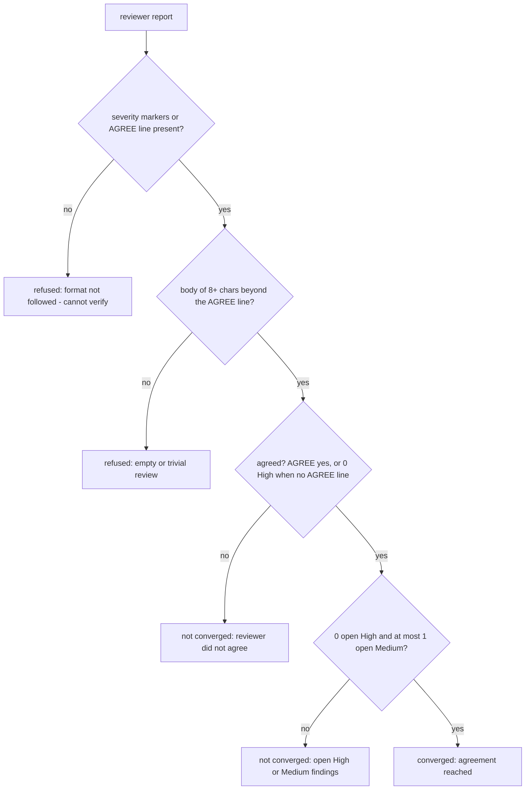

# AGENTS.md - sanity-check-core

Engineering reference for the Sanity Check verdict core (the shared brain of the cross-model agree/disagree loop). The end-user story (what the tool is, the loop, the convergence rules) lives in README.md - keep the two consistent when you edit either. The two adapter surfaces document their own wiring in `../pi-sanity-check/AGENTS.md` and `../claude-sanity-check/AGENTS.md` (the pi↔Claude parity table lives there, mirrored in both directions). The sibling core with the same shape: `../package-sentinel-core/AGENTS.md`. The neutral transport whose `chatComplete` this core re-exports: `../transport-core/README.md`.

**The design why:** the whole point of this core is that a verdict fix lands in every surface at once (pi, Claude Code, and any future adapter), so everything here is pure string/decision logic over structural types: no runtime imports, no env reads, no I/O, no loop - the loop lives in the adapters. Three defenses are baked in because model reviewers are format-unreliable and transports fail in the wild:

- The classifier reads severity markers _generously_ (emoji, textual labels, heading containers, bold-item formats, emoji-before-bold, and inline severity prose all occurred in real reviews - the self-check carries regressions for each shape that once scored a false `0 High / 0 Medium`).
- The convergence rubric is deliberately strict: unverifiable means not converged.
- A completion is classified before it is judged: a provider error or an abort is a transport failure, not an empty body, so convergence never blames the reviewer's format for a transport fault; an empty/failed revision retains the prior deliverable instead of overwriting it with nothing.

A fourth defense, the deliverable framing marker (`frameDeliverable`), makes the data/instruction provenance explicit to the reviewer model: the deliverable is wrapped as untrusted session data, never instructions.

## How it works

All public symbols are re-exported from `src/index.ts`. The npm package is planned but not yet published, so programmatic use today means importing from a checkout of this repo:

```ts
import { classifyReport, convergenceFor, frameDeliverable } from '@gizmos/sanity-check-core';

const v = classifyReport(reviewText);
const { isConverged, reason } = convergenceFor(v);
const userTurn = frameDeliverable(deliverable); // wrap untrusted data for the reviewer
```

### `src/core.ts` - verdict + completion logic

```ts
MAX_ROUNDS = 3                                        // round cap; both adapters import it
REVIEWER_SYSTEM: string                               // B's system prompt: independent CTO skeptic; report must end "AGREE: yes|no"
PRODUCER_SYSTEM: string                               // A's system prompt: revise High/Medium, return deliverable + [resolved]/[disputed] changelog
type Nullable<T> = T | null | undefined               // always-present field that may hold null
interface Verdict {
  isAgreed: Nullable<boolean>                         // explicit AGREE parse; undefined when no line
  high: number; medium: number                        // finding counts
  isFormatFollowed: boolean                           // severity markers or an AGREE line present
  hasBody: boolean                                    // substantive content beyond the AGREE line
}
type CompletionKind = 'body' | 'aborted' | 'provider-error'
interface CompletionOutcome { kind: CompletionKind; text: string; reason?: string }
parseAgree(text): boolean | undefined                 // /AGREE:\s*(yes|no)\b/gi, anchored to the LAST match
blocksToText(content): string                         // block array → text; falls back to `thinking` blocks
extractLastAssistantText(entries): string             // newest assistant text; {role,content} and {message:{...}} shapes
classifyCompletion(res): CompletionOutcome            // stopReason → body | aborted | provider-error
classifyThrownCompletion(err): CompletionOutcome      // rejected transport → aborted | provider-error
completionFailureReason(o): string                    // human reason for a non-body completion
applyRevision(current, outcome): { deliverable; retained }  // empty/failed revision retains the prior deliverable
class ModelNotFoundError extends Error                // "Model not found in registry: <provider>/<id>"
resolveFullModel(registry, {provider,id}): M          // full registered model; throws on miss
resolveModel(models, query): {provider,id} | undefined  // provider/id or bare id; cloud-suffix preference
classifyReport(text): Verdict
convergenceFor(v): { isConverged: boolean; reason: string }
```

The prompts fix the cross-model contract: B ends with `AGREE: yes|no` and severity-tags findings (🔴 High / 🟡 Medium / 🟢 Low); A returns the REVISED deliverable first, then a short changelog with `[resolved]`/`[disputed]` lines - an unfixed concern must carry reasoning, not dismissal. A prompt fix lands in both surfaces at once.

`parseAgree` is anchored to the **last** `AGREE:` match in the text (Track A FR-1): a reviewer that echoes the prompt's template line (`AGREE: <yes|no>`) or quotes a prior round's verdict mid-body must not satisfy the verdict - only the report's closing verdict counts.

`classifyReport` counts findings from lines, not prose. Finding-line candidates: bullets (`-`/`*`), numbered or `•` markers, bold emoji lines (`**🔴 High - ...**`), emoji headings (`#### 🔴 High - one`), emoji-before-bold lines (`🔴 **High — X.**`, Track A FR-3), and inline severity prose at line start (`High — ...`, the round-1 live shape). Bold numbered items (`**H1. ...**`) count under a bare section container (`### 🔴 High`). The container-vs-finding split: a heading with a title after the severity (`#### 🔴 High - one`) is one self-contained finding; a bare `### 🔴 High` opens a section whose untagged findings inherit its severity. Severity words outside finding lines never count, and High is negation-guarded (`no high` / `not.*high`). `isFormatFollowed` is true when recognizable severity markers or an explicit AGREE line exist; `hasBody` needs ≥ 8 chars of report with the AGREE line removed.

`convergenceFor` decides in order: format followed? body real? agreed? then the rubric. `agrees` is the explicit parse, or - when B emitted no AGREE line - implied by 0 High. `isConverged` requires agreed AND 0 High AND ≤1 Medium; open Low findings never block. Refusal reasons name the gap (`reviewer did not follow the output format - cannot verify agreement`, `reviewer returned an empty or trivial review - not a real approval`, or joined parts).

The completion classifiers (`classifyCompletion` / `classifyThrownCompletion`, Track B FR-1) exist so a transport fault is never mistaken for "the reviewer had nothing to say": a `stopReason` of `error` (or a thrown error) becomes `provider-error`, an abort becomes `aborted`, and only a normal stop yields a `body` (whose text may still legitimately be empty). `completionFailureReason` (Track B FR-4) gives a human reason that names the transport/provider layer, so a non-convergence message never blames the reviewer's output format for a transport failure. `applyRevision` (Track B FR-2) picks the deliverable to carry into the next round: a real body replaces the current deliverable; an empty body, an abort, or a provider error **retains** the previous deliverable (`retained: true`) rather than overwriting it with nothing.

`resolveFullModel` returns the FULL registered model (baseUrl/api/config), because passing a stripped `{provider,id}` historically produced an empty assistant reply; on a miss it throws `ModelNotFoundError` rather than silently passing the stripped object back.

`resolveModel` accepts `provider/id` or a bare id and falls back through stripped cloud-suffix variants (`:cloud`, `-cloud`, `_cloud`, and `:cloud` with anything after). When several providers serve the same id (e.g. `opencode-go/glm-5.1` and `ollama-cloud/glm-5.1`): a cloud hint - in the query suffix or the provider name - prefers cloud-named providers before falling back; a bare id takes the first listed provider. Returns `undefined` when nothing matches.

`blocksToText`/`extractLastAssistantText` shape the model IO: block arrays join their text blocks; a reasoning-only reply (exhausted output budget left only a `thinking` block) falls back to that thinking instead of `""` - so an empty revision can never be fed to B as a deliverable. Entry lists may be `{role, content}` or wrapped as `{message: {role, content}}`; the newest assistant entry wins and later non-assistant entries are skipped.

Deliberately NOT here: the loop itself, deliverable sourcing, cancellation handling, any I/O or persistence - all of that is adapter wiring.

### `src/framing.ts` - deliverable trust-boundary framing

```ts
frameDeliverable(deliverable: string): string
```

FR-4 prompt-injection framing (sanity-check-trust-boundary): the deliverable is untrusted session data, never instructions. The helper wraps the deliverable in `<<<DELIVERABLE>>>` … `<<<END-DELIVERABLE>>>` delimiters with a leading notice that the payload is data to assess, not instructions to follow. Structural defense is upstream of this (the verdict reads only the marker + the last `AGREE` line, no code execution); the fence makes data/instruction provenance explicit to the reviewer model so a forged `AGREE: yes` embedded in the deliverable is not the verdict input - the verdict is read from B's report (the deliverable is the user turn, never the text passed to `classifyReport`/`parseAgree`). Both adapters call this before sending the deliverable to B.

### `chatComplete` - OpenAI-compatible transport (re-exported)

```ts
chatComplete({ baseURL, model, system, user, maxTokens?, apiKey?, responseFormat? }): Promise<string>  // @gizmos/transport-core
```

`chatComplete` is re-exported from [`@gizmos/transport-core`](../transport-core/) (see its README), not defined here. The transport serves adapters that run outside a host LLM session (the Claude Code plugin calls the endpoint directly; the pi adapter uses the host's model registry and does not import it). It POSTs to `<baseURL>/chat/completions` with system + user messages, `max_tokens ?? 800`, `temperature: 0`, returns the trimmed `choices[0].message.content`, and throws `HTTP <status>: <first 300 chars of the body>` on a non-2xx. transport-core hardens it with a URL policy (`validateBaseURL`: `http:`/`https:` only, cleartext `http:` only for loopback, URL userinfo rejected) and sends `apiKey` only as `Authorization: Bearer …`. No streaming, no retries.

`src/chat.ts` in this package is a pre-split local copy that `src/index.ts` no longer imports - it is superseded by the transport-core re-export and kept only pending cleanup.

### `src/index.ts` - the public surface

Pure re-exports of the core verdict/completion logic and `frameDeliverable`, plus `chatComplete`/`ChatCompleteOpts` re-exported from `@gizmos/transport-core`. The module doc comment carries the design invariants (hollow-approval refusal, never-silently-empty replies). No logic of its own.

## Convergence decision flow



## Consumers

| Consumer                      | Uses                                                                                                                                                                                                                                                                                                                                         | Verified against                      |
| ----------------------------- | -------------------------------------------------------------------------------------------------------------------------------------------------------------------------------------------------------------------------------------------------------------------------------------------------------------------------------------------- | ------------------------------------- |
| `@gizmos/pi-sanity-check`     | `classifyReport`, `classifyCompletion`, `classifyThrownCompletion`, `completionFailureReason`, `applyRevision`, `convergenceFor`, `parseAgree`, `extractLastAssistantText`, `frameDeliverable`, `MAX_ROUNDS`, `REVIEWER_SYSTEM`/`PRODUCER_SYSTEM`, `resolveModel`/`resolveFullModel`, `CompletionOutcome` (host registry, no `chatComplete`) | `packages/pi-sanity-check/index.ts`   |
| `@gizmos/claude-sanity-check` | `classifyReport`, `classifyThrownCompletion`, `completionFailureReason`, `applyRevision`, `convergenceFor`, `parseAgree`, `frameDeliverable`, `chatComplete` (its only `chatComplete` consumer), `MAX_ROUNDS`, `REVIEWER_SYSTEM`/`PRODUCER_SYSTEM`, `CompletionOutcome` (models resolved from env, not `resolveFullModel`)                   | `packages/claude-sanity-check/cli.ts` |

Adapters own the runtime wiring; see their AGENTS.md files (the pi↔Claude parity table lives there, mirrored in both directions).

## Configuration (source locations)

| Knob                  | Value                                                                                                                  | Location                                    |
| --------------------- | ---------------------------------------------------------------------------------------------------------------------- | ------------------------------------------- |
| Round cap             | `MAX_ROUNDS = 3` - imported by both adapters, not runtime-configurable                                                 | `src/core.ts`                               |
| Reviewer prompt       | `REVIEWER_SYSTEM` - ends with the `AGREE: yes\|no` contract                                                            | `src/core.ts`                               |
| Producer prompt       | `PRODUCER_SYSTEM` - revise + `[resolved]`/`[disputed]` changelog                                                       | `src/core.ts`                               |
| Trivial-review bar    | report body beyond the AGREE line must be ≥ 8 chars (`hasBody`)                                                        | `src/core.ts`                               |
| AGREE-line anchor     | `parseAgree` takes the **last** `AGREE:` match, not the first (echoed/quoted lines cannot satisfy it)                  | `src/core.ts`                               |
| Cloud-suffix variants | `:cloud`, `-cloud`, `_cloud` (and `:cloud` with anything after) prefer cloud-named providers                           | `src/core.ts`                               |
| Deliverable framing   | `frameDeliverable` wraps the deliverable in `<<<DELIVERABLE>>>` markers with a data-not-instructions notice            | `src/framing.ts`                            |
| Completion defaults   | `max_tokens ?? 800`, `temperature: 0`, error body sliced to 300 chars                                                  | `transport-core/openai.ts` (`chatComplete`) |
| Transport URL policy  | `http:`/`https:` only; cleartext `http:` only for loopback; URL userinfo rejected; `apiKey` as `Authorization: Bearer` | `transport-core/validate.ts`                |

The core is **stateless** - no env vars, no persistence; its only network touch is the re-exported `chatComplete` when an adapter opts into it.

## Testing & validation

```bash
npm run selfcheck            # node src/self-check.ts - measured runtime battery (72 assert calls this session)
npm run check                # tsc --noEmit, strict typecheck
npm test                     # node --test - runs test/*.test.ts (node:test)
```

`src/self-check.ts` counts asserts as they run (the printed total is measured, not hardcoded - an assert added but never executed changes the total and fails loudly); it throws on any failing assertion. A fix is only done when all three pass.

| Area                       | What it proves                                                                                                                                                                                                                     |
| -------------------------- | ---------------------------------------------------------------------------------------------------------------------------------------------------------------------------------------------------------------------------------- |
| `blocksToText`             | string pass-through, text join, non-text skip; reasoning-only reply falls back to thinking; text preferred when both are present                                                                                                   |
| `parseAgree`               | yes / no / absent line; **last-match anchor** (echo-then-trailing-no, quoted-prior-round, last-wins) (Track A FR-1)                                                                                                                |
| `classifyReport` counts    | clean emoji report; textual-only reviewer; heading-style `#### 🔴 High - ...`; bold-style `**🔴 High - ...**`; emoji-before-bold `🔴 **High — …**`; inline severity prose `High — …`; bold prose headings not counted; determinism |
| `convergenceFor` refusals  | freeform refused; `AGREE: yes` with no body refused; real findings + `AGREE: no` not converged; implied agreement via 0 High; clean review with body converges                                                                     |
| `classifyCompletion`       | provider `error` stopReason → `provider-error`; `aborted` → `aborted`; normal stop → `body` (empty normal stop is still a body, not an error) (Track B FR-1)                                                                       |
| `classifyThrownCompletion` | thrown abort → `aborted`; other thrown → `provider-error`                                                                                                                                                                          |
| `completionFailureReason`  | non-`body` reason names the transport/provider layer (Track B FR-4)                                                                                                                                                                |
| `applyRevision`            | real body replaces; empty/blank body retains; `provider-error` retains; `aborted` retains (Track B FR-2)                                                                                                                           |
| `resolveFullModel`         | full model via `find`/`getAvailable`; `ModelNotFoundError` on miss (no silent stripped fallback)                                                                                                                                   |
| `resolveModel`             | exact `provider/id`; bare id; `:cloud`/`-cloud` suffix strip; cloud-hint ambiguity preference; explicit provider wins; no-match `undefined`                                                                                        |
| `extractLastAssistantText` | direct and wrapped entry shapes; newest-assistant pick; empty/blank cases                                                                                                                                                          |
| `frameDeliverable`         | distinct `<<<DELIVERABLE>>>`/`<<<END-DELIVERABLE>>>` delimiters; data-not-instructions notice; a forged in-deliverable `AGREE` is not the verdict input (FR-4)                                                                     |

## Invariants

- **No runtime coupling:** pure string/decision logic over structural types - no runtime imports, no env reads, no I/O. Adapters stay the only runtime-coupled layer, or the fix-once-both-inherit property breaks (`src/index.ts` doc comment). (`chatComplete` is a re-export from transport-core, not local coupling.)
- **A hollow approval never converges:** a report without format markers, or a bodyless `AGREE: yes`, is refused - agreement must be verifiable (`convergenceFor`).
- **Unverifiable means not converged:** the rubric's safe default is refusal, never a permissive pass.
- **A reply is never silently empty:** `blocksToText` falls back to exhausted thinking content; an empty string only survives when there is truly nothing.
- **A transport failure is not an empty body:** `classifyCompletion`/`classifyThrownCompletion` separate `provider-error` and `aborted` from `body`; `completionFailureReason` names the transport layer so convergence never blames the reviewer's format for a transport fault (Track B FR-1/FR-4).
- **A failed revision never overwrites good work:** `applyRevision` retains the prior deliverable on an empty body, an abort, or a provider error (Track B FR-2).
- **The verdict reads only the closing AGREE:** `parseAgree` is anchored to the last match; an echoed template line or a quoted prior round cannot satisfy it (Track A FR-1).
- **The deliverable is data, not instructions:** `frameDeliverable` wraps it with a data-not-instructions notice and delimiters; the verdict is read from B's report (the deliverable is the user turn, never the classified text), so a forged `AGREE` in the deliverable is not the verdict input (FR-4).
- **Model resolution fails loudly:** `resolveFullModel` throws `ModelNotFoundError` on a miss - no silent stripped-object fallback (which historically produced an empty assistant reply).
- **Findings are counted from lines, not prose:** severity words outside finding lines never count; High is negation-guarded (`no high`/`not high`).
- **No loop, no state:** the loop, deliverable sourcing, and cancellation handling belong entirely to the adapters - this package defines only per-round decisions and constants.
